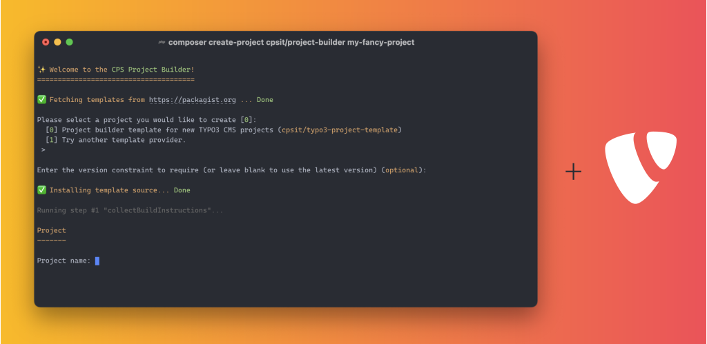

<div align="center">



# TYPO3 CMS project builder template

[](https://github.com/CPS-IT/typo3-project-template/actions/workflows/cgl.yaml)
[](https://packagist.org/packages/cpsit/typo3-project-template)
[](https://packagist.org/packages/cpsit/typo3-project-template)
[](LICENSE.md)

📦&nbsp;[Packagist](https://packagist.org/packages/cpsit/typo3-project-template) |
💾&nbsp;[Repository](https://github.com/CPS-IT/typo3-project-template) |
🐛&nbsp;[Issue tracker](https://github.com/CPS-IT/typo3-project-template/issues)

</div>

This is a template repository for the [CPS Project Builder](https://github.com/CPS-IT/project-builder).
It provides a complete template for new [TYPO3 CMS](https://typo3.org) projects, including a
ready-to-use DDEV configuration and basic configuration for deployment with Deployer.

## 🚀 Features

### Core features

* Composer-based [TYPO3 CMS](https://typo3.org) project template
* Ready-to-use [DDEV](https://ddev.readthedocs.io) configuration
* Compatible with TYPO3 11.5 LTS, 12.4 LTS and 13.0
* Support of current stable PHP versions, starting from PHP 8.0

### Optional features

* Static code analysis template with [PHPStan](https://phpstan.org/)
* Automatic code migration with [TYPO3 Rector](https://www.typo3-rector.com/)
* Basic [Deployer](https://deployer.org/) deployment configuration

## 🔥 Getting started

1. [Create](https://project-builder.cps-it.de/usage/composer.html) a new project:

   ```bash
   composer create-project cpsit/project-builder
   ```

2. Select the package `cpsit/typo3-project-template`.
3. Answer all questions and you're ready to go.

## 🧑‍💻 Development

Please have a look at [`CONTRIBUTING.md`](CONTRIBUTING.md).

## ⭐ License

This project is licensed under [GNU General Public License 3.0 (or later)](LICENSE.md).
